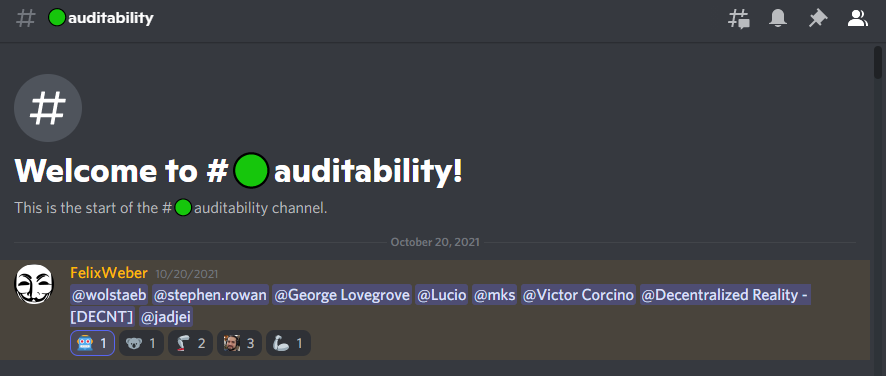

# Catalyst Community Auditability

## Background

At the Project Catalyst After Town Hall of 20th October 2021 a workshop session initiated a Catalyst Community Auditability team with the intention to collaborate on a common funded cohort reporting standards.

A pilot is planned that will include a large sample of Fund 6 proposals drawn from the Catalst community network.

## 20th October 2021 After Town Hall

### Timestamped Recording

To follow

### Cohort audit actions



## &#x20;Auditability Discord Channel

An auditability channel was created on 20th October 2021 to facilate development of reporting standards for the prospective audit team fund 6 cohort.



## **Quest for Taxonomy**

.png>)
