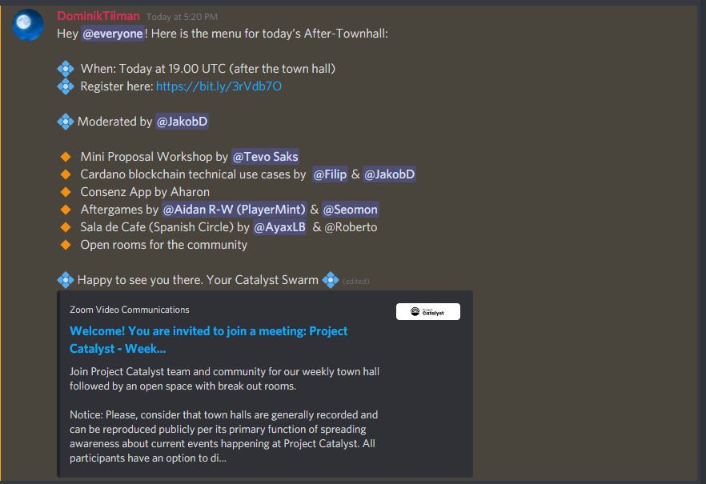
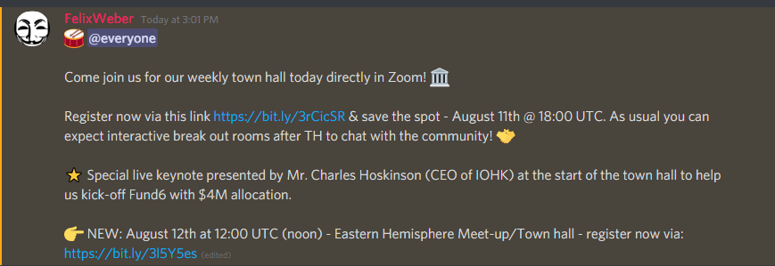

# Catalyst Town Halls - August 2021

## August 4th, Town Hall



&#x20; Timestamps:

[00:00:00](https://www.youtube.com/watch?v=josSLLQKZZ4\&t=0s) Welcome to Project Catalyst Town Hall #17

[00:02:59](https://www.youtube.com/watch?v=josSLLQKZZ4\&t=179s) Keynote Speaker - John O’Connor

[00:18:30](https://www.youtube.com/watch?v=josSLLQKZZ4\&t=1110s) Cohort Update with Kriss Baird

[00:30:18](https://www.youtube.com/watch?v=josSLLQKZZ4\&t=1818s) What are we going to accomplish together & Fund6 innovation phase

[00:31:44](https://www.youtube.com/watch?v=josSLLQKZZ4\&t=1904s) The proposer, referrer and the implementer

[00:50:58](https://www.youtube.com/watch?v=josSLLQKZZ4\&t=3058s) Fund6 challenges

[00:51:26](https://www.youtube.com/watch?v=josSLLQKZZ4\&t=3086s) Fund7 challenge setting

[00:51:45](https://www.youtube.com/watch?v=josSLLQKZZ4\&t=3105s) Challenge Teams

[00:52:30](https://www.youtube.com/watch?v=josSLLQKZZ4\&t=3150s) Catalyst Circle update with Felix

[00:56:08](https://www.youtube.com/watch?v=josSLLQKZZ4\&t=3368s) Proposal forming & writing

[01:05:09](https://www.youtube.com/watch?v=josSLLQKZZ4\&t=3909s) Catalyst School Intro with Victor Corcino

[01:09:25](https://www.youtube.com/watch?v=josSLLQKZZ4\&t=4165s) Providing structured feedback

[01:13:17](https://www.youtube.com/watch?v=josSLLQKZZ4\&t=4397s) What to do next?

[01:13:45](https://www.youtube.com/watch?v=josSLLQKZZ4\&t=4425s) Registration For Fund6 ongoing

[01:16:20](https://www.youtube.com/watch?v=josSLLQKZZ4\&t=4580s) Wada team update

[01:19:45](https://www.youtube.com/watch?v=josSLLQKZZ4\&t=4785s) Useful links

[01:21:10](https://www.youtube.com/watch?v=josSLLQKZZ4\&t=4870s) Open Space with Swarm



### After Town Hall

### Mini Proposal Workshop #2 by Tevo



#### &#x20;Chapters:

[00:00](https://www.youtube.com/watch?v=uusg5gOAbFk\&t=0s) - What are mini-proposals

[03:12](https://www.youtube.com/watch?v=uusg5gOAbFk\&t=192s) - What are your expectations?

[08:45](https://www.youtube.com/watch?v=uusg5gOAbFk\&t=525s) - Explaining Options we vote on

1[3:00](https://www.youtube.com/watch?v=uusg5gOAbFk\&t=780s) - Voting results

[14:20](https://www.youtube.com/watch?v=uusg5gOAbFk\&t=860s) - Recap of previous workshops

&#x20;[21:20](https://www.youtube.com/watch?v=uusg5gOAbFk\&t=1280s) - Starting the Workshop

## August 11th, Town Hall



### &#x20;Timestamps:

[00:00:00](https://www.youtube.com/watch?v=crs3lVaGejY\&t=0s) Welcome to Project Catalyst Town Hall #1 for Fund 6

[00:01:24](https://www.youtube.com/watch?v=crs3lVaGejY\&t=84s) Keynote by Charles Hoskinson

[00:17:00](https://www.youtube.com/watch?v=crs3lVaGejY\&t=1020s) Thank you to the stewards of Catalyst

[00:18:06](https://www.youtube.com/watch?v=crs3lVaGejY\&t=1086s) What is project Catalyst?

[00:29:15](https://www.youtube.com/watch?v=crs3lVaGejY\&t=1755s) Ways to contribute & participate

[00:31:44](https://www.youtube.com/watch?v=crs3lVaGejY\&t=1904s) Fund 6 outline - $4M Total budget & Challenges

[00:41:12](https://www.youtube.com/watch?v=crs3lVaGejY\&t=2472s) New role - Challenge teams

[00:45:36](https://www.youtube.com/watch?v=crs3lVaGejY\&t=2736s) Insight sharing phase - what is it and how it works

[00:50:06](https://www.youtube.com/watch?v=crs3lVaGejY\&t=3006s) Fund6 timeline

[00:52:08](https://www.youtube.com/watch?v=crs3lVaGejY\&t=3128s) Next steps

[00:54:14](https://www.youtube.com/watch?v=crs3lVaGejY\&t=3254s) Registration For Fund6 voting starts tomorrow!

[00:56:00](https://www.youtube.com/watch?v=crs3lVaGejY\&t=3360s) [#wenrewards](https://www.youtube.com/hashtag/wenrewards) for Fund5? Next week!

[00:56:44](https://www.youtube.com/watch?v=crs3lVaGejY\&t=3404s) Register for the next Townhall&#x20;

0[0:57:03](https://www.youtube.com/watch?v=crs3lVaGejY\&t=3423s) Useful links

[01:02:18](https://www.youtube.com/watch?v=crs3lVaGejY\&t=3738s) Open Space with Swarm&#x20;

[01:11:03](https://www.youtube.com/watch?v=crs3lVaGejY\&t=4263s) One year anniversary of Fund1 with Steve Aldrich

### Slides



### After Town Hall

### Mini Proposal Workshop #3 by Tevo Saks



## 18th August 2021, Town Hall



Join Daniel Ribar (Community Manager) and the rest of the community for our weekly Catalyst update.

### &#x20;Timestamps:

[00:00:00](https://www.youtube.com/watch?v=josSLLQKZZ4\&t=0s) Welcome to Project Catalyst Town Hall #17

[00:02:59](https://www.youtube.com/watch?v=josSLLQKZZ4\&t=179s) Keynote Speaker - John O’Connor

[00:18:30](https://www.youtube.com/watch?v=josSLLQKZZ4\&t=1110s) Cohort Update with Kriss Baird

[00:30:18](https://www.youtube.com/watch?v=josSLLQKZZ4\&t=1818s) What are we going to accomplish together & Fund6 innovation phase

[00:31:44](https://www.youtube.com/watch?v=josSLLQKZZ4\&t=1904s) The proposer, referrer and the implementer

[00:50:58](https://www.youtube.com/watch?v=josSLLQKZZ4\&t=3058s) Fund6 challenges

[00:51:26](https://www.youtube.com/watch?v=josSLLQKZZ4\&t=3086s) Fund7 challenge setting

[00:51:45](https://www.youtube.com/watch?v=josSLLQKZZ4\&t=3105s) Challenge Teams

[00:52:30](https://www.youtube.com/watch?v=josSLLQKZZ4\&t=3150s) Catalyst Circle update with Felix

[00:56:08](https://www.youtube.com/watch?v=josSLLQKZZ4\&t=3368s) Proposal forming & writing

[01:05:09](https://www.youtube.com/watch?v=josSLLQKZZ4\&t=3909s) Catalyst School Intro with Victor Corcino

[01:09:25](https://www.youtube.com/watch?v=josSLLQKZZ4\&t=4165s) Providing structured feedback

[01:13:17](https://www.youtube.com/watch?v=josSLLQKZZ4\&t=4397s) What to do next?

[01:13:45](https://www.youtube.com/watch?v=josSLLQKZZ4\&t=4425s) Registration For Fund6 ongoing

[01:16:20](https://www.youtube.com/watch?v=josSLLQKZZ4\&t=4580s) Wada team update

[01:19:45](https://www.youtube.com/watch?v=josSLLQKZZ4\&t=4785s) Useful links

[01:21:10](https://www.youtube.com/watch?v=josSLLQKZZ4\&t=4870s) Open Space with Swarm

### Slides



### After Town Hall

### Entrepreneur Toolkit with Kriss Baird



Kriss Baird ( Product Owner - Catalyst ) and the community discussion about the Challenge of onboarding and educating Entrepreneurs in the Cardano Ecosystem.

### Cardano Atala Prism - AMA with John O'Connor



### Mini Proposal Workshop #4



In this session, we created spent quite some time do write an understandable problem statement for something as complex as visualizing DAO's

Hosted by Tevo and Stephen

## 25th August 2021, Town Hall



### &#x20;Timestamps:

[00:00:15](https://www.youtube.com/watch?v=C1pcZWFqAV8\&t=15s) Welcome to Project Catalyst Fund 6 Town Hall #3

[00:04:25](https://www.youtube.com/watch?v=C1pcZWFqAV8\&t=265s) Final call for proposal submission

[00:09:01](https://www.youtube.com/watch?v=C1pcZWFqAV8\&t=541s) Cohort update by Ashish Prajapati, Cardanoscan.io

[00:14:58](https://www.youtube.com/watch?v=C1pcZWFqAV8\&t=898s) Cohort update by Sebastien Guillemot, dcSpark - Cardano Message Signing

00: [21:45](https://www.youtube.com/watch?v=C1pcZWFqAV8\&t=1305s) Catalyst Coordinator

[00:25:21](https://www.youtube.com/watch?v=C1pcZWFqAV8\&t=1521s) Welcome Fund6 Proposers!

00: [27:19](https://www.youtube.com/watch?v=C1pcZWFqAV8\&t=1639s) Challenge Setting

[00:31:15](https://www.youtube.com/watch?v=C1pcZWFqAV8\&t=1875s) Fund6 innovation phase

[00:32:45](https://www.youtube.com/watch?v=C1pcZWFqAV8\&t=1965s) Proposer checklist & The self-assessment checklist

[00:34:46](https://www.youtube.com/watch?v=C1pcZWFqAV8\&t=2086s) How to refine proposals

[00:38:32](https://www.youtube.com/watch?v=C1pcZWFqAV8\&t=2312s) Merge efforts when sensible

[00:40:15](https://www.youtube.com/watch?v=C1pcZWFqAV8\&t=2415s) Giving feedback

[00:47:35](https://www.youtube.com/watch?v=C1pcZWFqAV8\&t=2855s) Catalyst circle update

[00:53:49](https://www.youtube.com/watch?v=C1pcZWFqAV8\&t=3229s) We’re hiring!

[00:56:25](https://www.youtube.com/watch?v=C1pcZWFqAV8\&t=3385s) Useful links

[00:58:20](https://www.youtube.com/watch?v=C1pcZWFqAV8\&t=3500s) Open Space with Swarm

### Slides



### After Town Hall

### Project Catalyst Challenge Setting Proposals for Fund 7



Steve Lockhart and Dominik Tilman discussed in the breakout room "Challenge Setting Proposals" about the need of mission driven challenges for Project Catalyst in the After Town Hall on August 25, 2021.

### RFM Challenge Team Candidates



In this Video the candidates for the rapid funding mechanism (RFM) Challenge Team present themself to the Catalyst Community

### GameChanger Wallet Demo by Adriano



GameChanger Wallet allows all the standard wallet functionalities + NFT batch minting + multiple transactions at one time. It also allows users to create shareable URLs and customizable HTML code.&#x20;

Check it out at:



### Mini Proposal workshop v1 overview



Hosted by Tevo and Stephen

