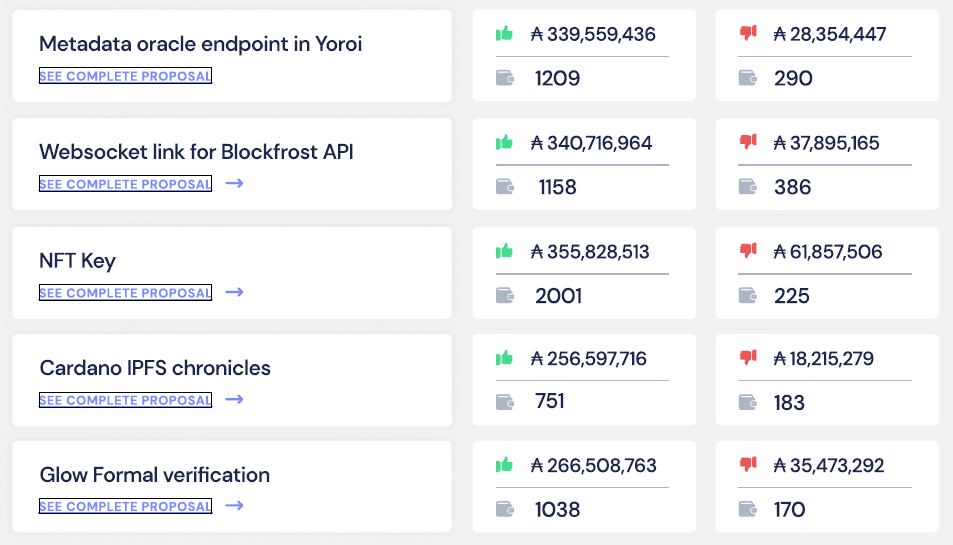
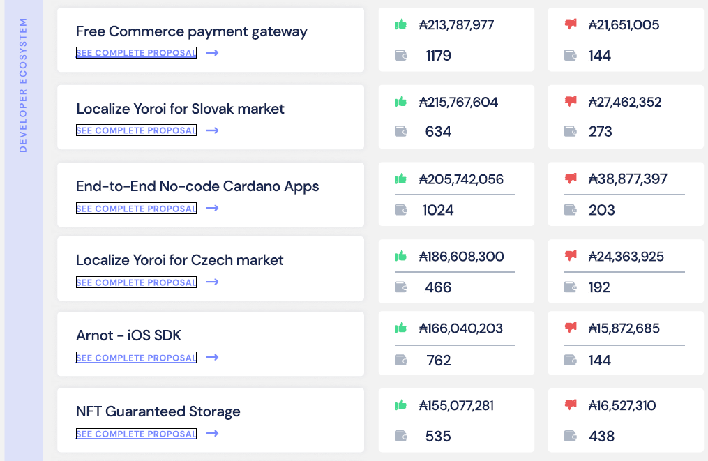
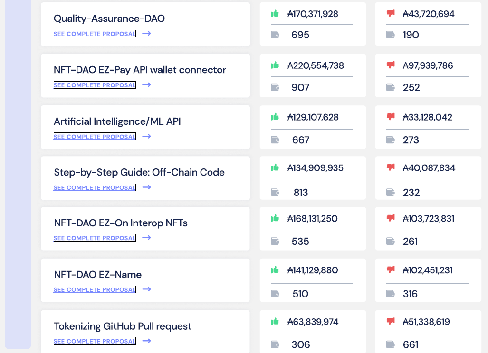
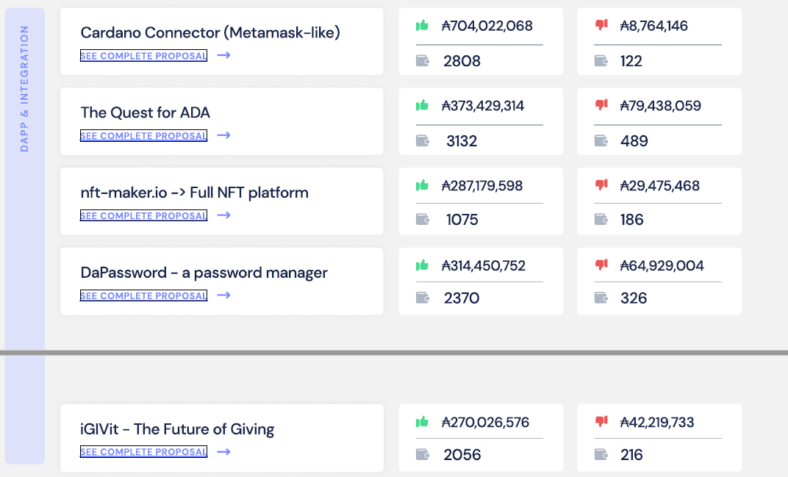

# Fund 5 Voting Results - August 2021

## Source :



## Funded Proposals

### Developer Ecosystem

### DAPP & Integration

### Distributed Decision Making

### Proposer Outreach

### Catalyst Value On-Boarding

### Metadata Challenge

### Grow Africa, Grow Cardano

### Scale Up Cardano & DEFI Ecosystem

### Fund 7 - Challenge Setting

### Leftover Funds Allocation

