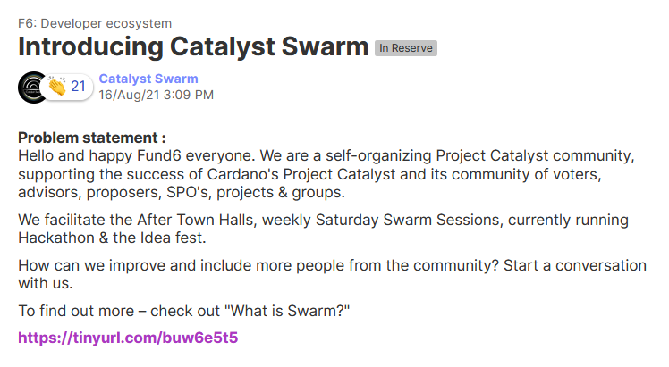
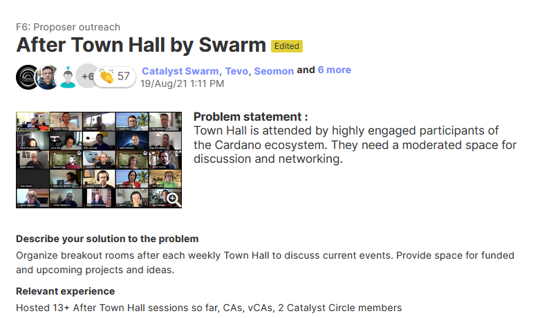

# Project Catalyst - Fund 6

## Insight Sharing

###  [F6: Developer ecosystem](https://cardano.ideascale.com/a/campaign-home/26094) - Introducing Catalyst Swarm

**Hello and happy Fund6 everyone**. We are a self-organizing Project Catalyst community, supporting the success of Cardano's Project Catalyst and its community of voters, advisors, proposers, SPO's, projects & groups.

We facilitate the After Town Halls, weekly Saturday Swarm Sessions, currently running Hackathon & the Idea fest.

How can we improve and include more people from the community? Start a conversation with us.


To find out more – check out "What is Swarm?"

[https://tinyurl.com/buw6e5t5](https://tinyurl.com/buw6e5t5)




##  Proposals

### After Town Hall by Swarm - F6: Proposer outreach -  

 **Problem statement :**

Town Hall is attended by highly engaged participants of the Cardano ecosystem. They need a moderated space for discussion and networking.

 **Describe your solution to the problem**

Organize breakout rooms after each weekly Town Hall to discuss current events. Provide space for funded and upcoming projects and ideas.



