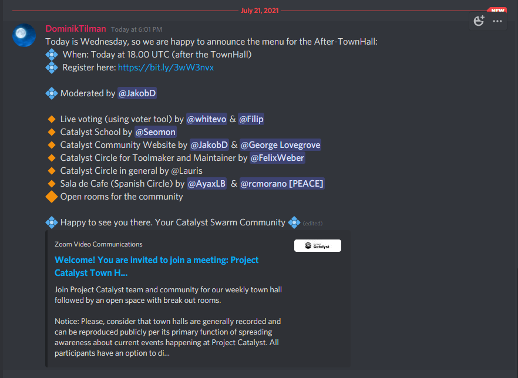

# Catalyst Town Halls - July 2021

## July 1st Town Hall

#### Project Catalyst Town Hall #14B

A recording of June 30th, Town Hall for the Eastern Hemisphere Timezone.



## July 7th Town Hall

### Project Catalyst Town Hall #15



### Timestamps

Please note that timestamps open in a new tab:

#### [00:00:00](https://www.youtube.com/watch?v=langx68O9QE\&t=0s) Welcome to Project Catalyst Town Hall #15

#### [00:03:36](https://www.youtube.com/watch?v=langx68O9QE\&t=216s) Presentation from Kyle Solomon - Fund 3 Cohort - Ada Tx to Trigger IoT + IO HW Spins

#### [00:14:42](https://www.youtube.com/watch?v=langx68O9QE\&t=882s) Hackathon presentation by Boone Bergsma - Fund3 cohort member

#### [00:25:43](https://www.youtube.com/watch?v=langx68O9QE\&t=1543s) Congratulations to Fund4 funded proposals

#### [00:26:55](https://www.youtube.com/watch?v=langx68O9QE\&t=1615s) Fund4 Updates

#### [00:28:30](https://www.youtube.com/watch?v=langx68O9QE\&t=1710s) Fund 5 governance timeline & voting registration instructions

#### [00:34:34](https://www.youtube.com/watch?v=langx68O9QE\&t=2074s) vCA Fund5 outcomes published

#### [00:35:04](https://www.youtube.com/watch?v=langx68O9QE\&t=2104s) Catalyst Circle Update

#### [00:36:10](https://www.youtube.com/watch?v=langx68O9QE\&t=2170s) Catalyst Idea Fest

#### [00:46:07](https://www.youtube.com/watch?v=langx68O9QE\&t=2767s) Useful links

#### [00:47:25](https://www.youtube.com/watch?v=langx68O9QE\&t=2845s) Breakout rooms

### Slides



## July 7th After Town Hall

### Diversity/ Inclusion Breakout room



## July 14th , Town hall

### Project Catalyst Town Hall #16

Join Dor Garbash (Product Manager), Daniel Ribar (Community Manager) and rest of the community for our weekly Catalyst update.



#### [00:00:00](https://www.youtube.com/watch?v=\_H-dSnMmpA4\&t=0s) Welcome to [#ProjectCatalyst](https://www.youtube.com/hashtag/projectcatalyst)

#### [00:02:42](https://www.youtube.com/watch?v=\_H-dSnMmpA4\&t=162s) BIG KUDOS to tonight’s language pioneers

#### [00:04:17](https://www.youtube.com/watch?v=\_H-dSnMmpA4\&t=257s) Presentation by Stephen Whitenstall from Catalyst GitBook Project

#### [00:16:02](https://www.youtube.com/watch?v=\_H-dSnMmpA4\&t=962s) Fund6 Challenge Setting Preview with Kriss Baird

#### [00:25:23](https://www.youtube.com/watch?v=\_H-dSnMmpA4\&t=1523s) [#wenrewards](https://www.youtube.com/hashtag/wenrewards)? This week!

#### [00:28:49](https://www.youtube.com/watch?v=\_H-dSnMmpA4\&t=1729s) Fund 5 governance timeline

#### [00:30:05](https://www.youtube.com/watch?v=\_H-dSnMmpA4\&t=1805s) What will Fund5 bring?

#### [00:31:57](https://www.youtube.com/watch?v=\_H-dSnMmpA4\&t=1917s) Tell us - why are you voting?

#### [00:42:06](https://www.youtube.com/watch?v=\_H-dSnMmpA4\&t=2526s) Ways to register & Registration requirements

#### [00:44:01](https://www.youtube.com/watch?v=\_H-dSnMmpA4\&t=2641s) Catalyst Circle Update

#### [01:00:01](https://www.youtube.com/watch?v=\_H-dSnMmpA4\&t=3601s) IdeaFest Update with Aidan

#### [01:07:11](https://www.youtube.com/watch?v=\_H-dSnMmpA4\&t=4031s) Useful Links

#### [01:07:46](https://www.youtube.com/watch?v=\_H-dSnMmpA4\&t=4066s) Breakout rooms

### Slides



### After Town Hall

## July 21st, Town Hall

### Project Catalyst Town Hall #17

Join Dor Garbash (Product Manager), Daniel Ribar (Community Manager) and rest of the community for our weekly Catalyst update.



### Slides



### After Town Hall

### Catalyst School Session

#### Simon and Stephen



### Collective Live Voting

In this video, we are using the community-created tool to look at the proposals and give our collective view of how we would vote on Catalyst Proposals.



&#x20;We focused on Distributed Decision Making challenge.&#x20;

#### Our collective Expert Ballot:



#### Session Notes on Miro Board:



## July 28th, Town Hall



Join Dor Garbash (Product Manager), Daniel Ribar (Community Manager) and the rest of the community for our weekly Catalyst update.

### &#x20;Timestamps:

[00:00:00](https://www.youtube.com/watch?v=dLWrq0u\_Qwg\&t=0s) Welcome to Project Catalyst Town Hall #17&#x20;

[00:04:28](https://www.youtube.com/watch?v=dLWrq0u\_Qwg\&t=268s) Introduction of Eastern Hemisphere Town Halls&#x20;

[00:19:16](https://www.youtube.com/watch?v=dLWrq0u\_Qwg\&t=1156s) Our goal: Legitimize decentralized governance&#x20;

[00:33:29](https://www.youtube.com/watch?v=dLWrq0u\_Qwg\&t=2009s) Fund 5 governance timeline

[00:33:54](https://www.youtube.com/watch?v=dLWrq0u\_Qwg\&t=2034s) Fund5 Ballot Updates&#x20;

[00:35:28](https://www.youtube.com/watch?v=dLWrq0u\_Qwg\&t=2128s) Ready for Fund6?

[00:36:21](https://www.youtube.com/watch?v=dLWrq0u\_Qwg\&t=2181s) General Voter Circle Seat&#x20;

[00:38:00](https://www.youtube.com/watch?v=dLWrq0u\_Qwg\&t=2280s) Next Town Hall&#x20;

[00:38:29](https://www.youtube.com/watch?v=dLWrq0u\_Qwg\&t=2309s) Useful links&#x20;

[00:38:57](https://www.youtube.com/watch?v=dLWrq0u\_Qwg\&t=2337s) Open Space

### Slides



### After Town Hall

### Sala de Café After Townhall Project Catalyst Cardano Español # 1



Aquí les traemos la primera entrega de "Sala de café" After Townhall Swarm Session en donde disponemos de un espacio libre para hablar sobre el ecosistema blockchain enfocado a Cardano y Project Catalyst.

### Mini Proposal Workshop hosted by Tevo Saks



This was 2nd attempt at gathering people and working on Mini-proposals In this session, we chose to continue with ideas started in the first session by a different group.

#### Chapters:

[00:00](https://www.youtube.com/watch?v=gPifzITmqsk\&t=0s) - Opening Introductions

[04:15](https://www.youtube.com/watch?v=gPifzITmqsk\&t=255s) - How we work on Mini-proposals

[07:15](https://www.youtube.com/watch?v=gPifzITmqsk\&t=435s) - How do we proceed with this session?

[13:00](https://www.youtube.com/watch?v=gPifzITmqsk\&t=780s) - Repeating Introductions

[14:05](https://www.youtube.com/watch?v=gPifzITmqsk\&t=845s) - New Introductions

[20:00](https://www.youtube.com/watch?v=gPifzITmqsk\&t=1200s) - About Mini-Proposals again

[21:50](https://www.youtube.com/watch?v=gPifzITmqsk\&t=1310s) - Starting the Workshop

[54:40](https://www.youtube.com/watch?v=gPifzITmqsk\&t=3280s) - Session Feedback

#### Miro Board



