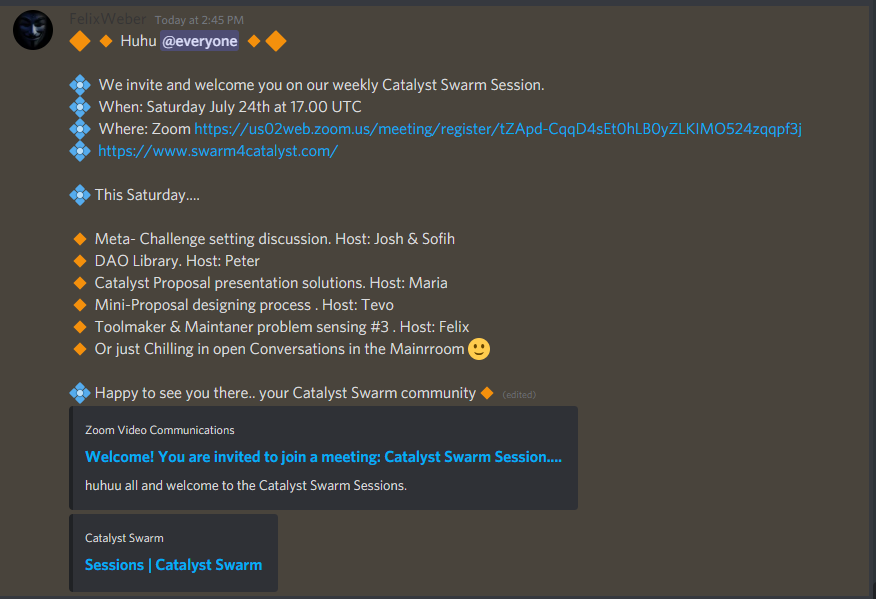
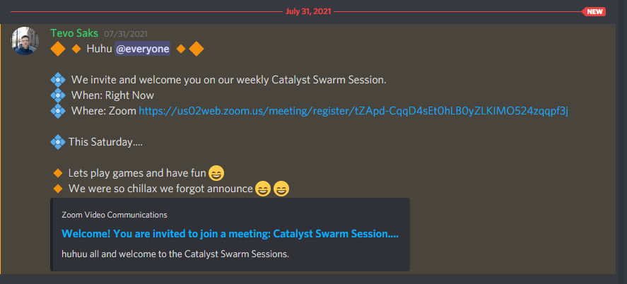

# Swarm Sessions - July 2021

## Saturday, 3rd July 2021

#### Discord Context



## Saturday, 17th July 2021

#### Discord Context



### DAO Library hosted by Pete Oliver-Krueger


DAO Library hosted by Pete Oliver-Krueger


#### Miro Board link:



### Toolmakers and Maintainers problem sensing hosted by Felix


Toolmakers and Maintainers problem sensing hosted by Felix


A more detailed breakdown of this session can be found on the [Catalyst Circle site](https://catalyst-swarm.gitbook.io/catalyst-circle/toolmakers-and-maintainers/activity#toolmakers-and-maintainers-problem-sensing).

## Saturday, 24th July 2021

#### Discord context



### DAO Library Session

An open session for the Cardano Catalyst Swarm open space. The topic today was different models for how to allocate and record contributions of effort in a Decentralized Autonomous Organization (DAO).



#### DAO Library working Doc



### Mini proposal workshop test run hosted by Tevo Saks


Mini proposal workshop test run hosted by Tevo Saks


#### Chapters:

[00:00](https://www.youtube.com/watch?v=CfpHc8TmmS8\&t=0s) Backstory

[01:40](https://www.youtube.com/watch?v=CfpHc8TmmS8\&t=100s) Mini-Proposal Process

[03:35](https://www.youtube.com/watch?v=CfpHc8TmmS8\&t=215s) Mini-Proposal results and strategy

[08:35](https://www.youtube.com/watch?v=CfpHc8TmmS8\&t=515s) Workshop

[43:45](https://www.youtube.com/watch?v=CfpHc8TmmS8\&t=2625s) How is this talking about education?

[46:05](https://www.youtube.com/watch?v=CfpHc8TmmS8\&t=2765s) Workshop Summary

[51:05](https://www.youtube.com/watch?v=CfpHc8TmmS8\&t=3065s) Feedback About Process

[57:10](https://www.youtube.com/watch?v=CfpHc8TmmS8\&t=3430s) Who is Blane?

#### Miro Board link:



## Saturday, 31st July 2021

