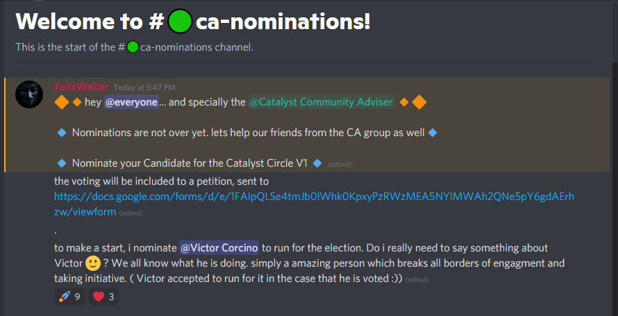
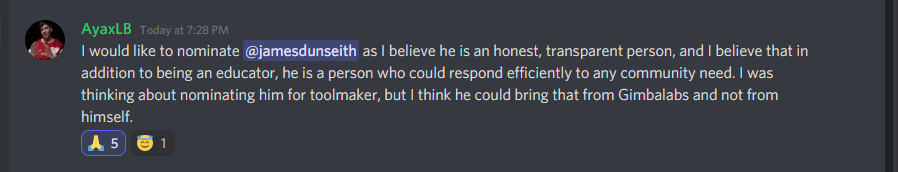

# Swarm Governance - June 2021

## Catalyst Circle Town Hall Announcement

### Discord Announcement

Link to Discord context on Catalyst Swarm & Sessions



### IOHK Youtube Channel



### Catalyst Circle definition



### Catalyst Circle Voting Procedure



### Town Hall Slides



### @InputOutputHK Twitter

### Cardano Forum Post



## Catalyst Circle Elections

### Candidate Nomination Form



### Toolmaker/ Maintainer nomination for Catalyst Circle V1



Link to Discord context



Link to Discord context on Catalyst Swarm & Sessions



Link to Discord context on Catalyst Swarm & Sessions



### CA Nominations

Link to Discord context on Catalyst Swarm & Sessions



Link to Discord context on Catalyst Swarm & Sessions



#### Victor petition



Link to Discord context on Catalyst Swarm & Sessions



#### Victor nomination statement

Link to Discord context on Catalyst Swarm & Sessions



#### raghuram withdrawal and nomination of Victor

Link to Discord context on Catalyst Swarm & Sessions



### Voter Nominations

Link to Discord context on Catalyst Swarm & Sessions



Link to Discord context on Catalyst Swarm & Sessions



#### Mercy petition

Link to Discord context on Catalyst Swarm & Sessions



## Catalyst Community Announcements

### 28/06/21 - Pre Town Hall Announcement

28th June 2021

Link to Discord context on Catalyst Swarm & Sessions


