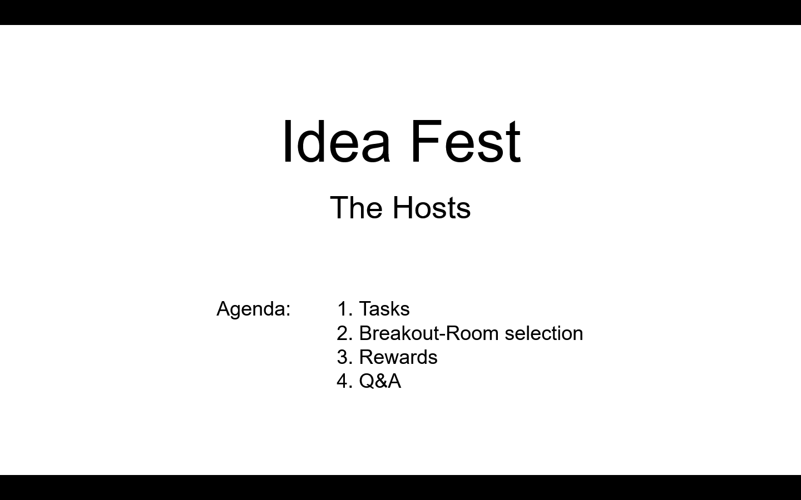

# Idea Fest - October 2021

## 30th September

### Room Host Presentation

#### Slide 1

#### Slide 2

#### Slide 3

#### Slide 4

#### Slide 5

#### Slide 6

## 1st October 2021

### Zoom Backgrounds by Felix

## 3rd October 2021

### Announcements

### Feedback Ideafest Fund 6 

### Method:

* Survey of the participants right after voting via google forms. 

### Sample:

* N = 28 \(8=General / Other, 15=Proposer, 5=Host\)

### Questions:

* What is your level of satisfaction for this event? \(Likert scale from 1 = Very low to 5 = very high\)
  * Average = 4,464
* Which elements of the event did you like the most?
  * Energy, positivity, welcoming and equal atmosphere
  * Kriss presentation \(3x mentioned\)
  * Variety of presentations
  * Interaction, Q&A, Face to face
  * Short format of presentations
  * Networking, connecting, idea sharing
* What, if anything, did you dislike about this event?
  * Voting suboptimal: Not all presentations could be seen
  * Room structure should be by category and not number
  * Technical difficulties
  * More buffer zones, transition time between presentations, more coffee breaks
  * Time commitments were not met in all rooms
  * Running overtime
  * Switching rooms was a bit nerve racking
* Why did you choose to attend our event and what are you hoping to take away from the experience?
  * Networking
  * New ideas
  * Learning about process and projects \(Ada holders / voters\)
  * Participating in projects / collaborations
  * Learn what good proposals are
  * More motivation
  * Contributing to Cardano / decentralized governance
  * Engage with Cardano community 
  * Broaden scope of experience
  * Getting feedback \(proposer\)
  * Funding

> “There is no where else to be! I am glad to meet proposers, connect, network and have some human face-to-face conversations and feel the energy of the community.”

* Are you likely to participate in one of our events in the future?
  * Average = 4,925
* How did you hear about this event? 
  * 15 = Swarm
  * 9 = Townhall
  * 3 = Newsletter / Ideascale
  * 0 = Twitter / Reddit

### Lessons learned: What could be changed for Ideafest F7?

* Room categorization according to funding challenge 
* More breaks / less tight schedule
* Voting should be delayed, e.g.after 1 week \(everyone was able to watch the presentations\) ; Maybe having different categories to win in \(like most creative presentation etc.\)

