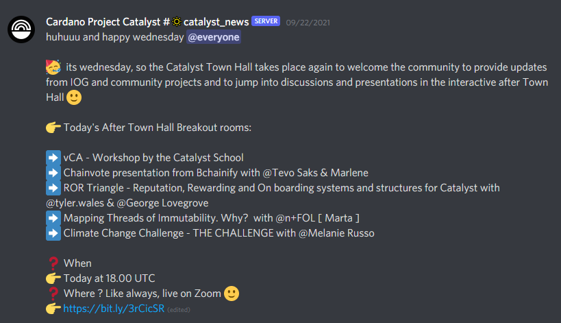
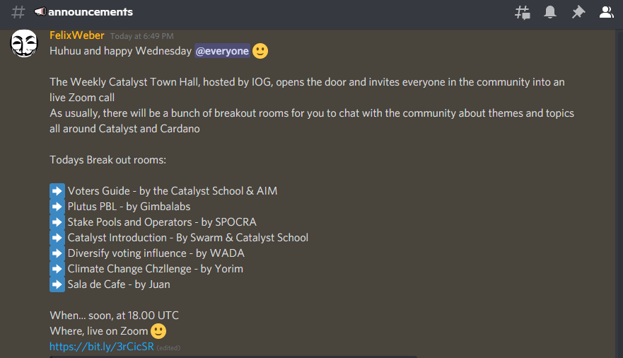

# Catalyst Town Halls - September 2021

## 1st September, Town Hall



Join Dor Garbash \(Product Manager\), Daniel Ribar \(Community Manager\) and the rest of the community for our weekly Catalyst update.

###  Timestamps:

[00:00:35](https://www.youtube.com/watch?v=9LfHn5mZJZk&t=35s) Welcome to Project Catalyst Fund 6 Town Hall \#

[00:02:40](https://www.youtube.com/watch?v=9LfHn5mZJZk&t=160s) Cohort Update by Satya Ranjan

[00:12:08](https://www.youtube.com/watch?v=9LfHn5mZJZk&t=728s) Refinement stage update 

[00:19:05](https://www.youtube.com/watch?v=9LfHn5mZJZk&t=1145s) Finalization stage - Quiet time

[00:24:05](https://www.youtube.com/watch?v=9LfHn5mZJZk&t=1445s) Catalyst Circle update

[00:33:26](https://www.youtube.com/watch?v=9LfHn5mZJZk&t=2006s) Community advisor registration & instructions by Victor Corcino

[00:39:32](https://www.youtube.com/watch?v=9LfHn5mZJZk&t=2372s) Rewards scheme for CAtalyst CA by Victor Corcino

[00:57:30](https://www.youtube.com/watch?v=9LfHn5mZJZk&t=3450s) Fund 4+5 Feedback Form

[01:00:39](https://www.youtube.com/watch?v=9LfHn5mZJZk&t=3639s) Dominic Tilman presenting Fund6 Ideafest

[01:05:48](https://www.youtube.com/watch?v=9LfHn5mZJZk&t=3948s) Weekly sessions & events

[01:09:26](https://www.youtube.com/watch?v=9LfHn5mZJZk&t=4166s) Open Space with Swarm

### Slides



### 1st September, After Town Hall

### Blockademia Verification System



Partnering with institutions to create and publicly sign their certificates on the Cardano blockchain.

#### Ideascale link



### Cardano Language & Culture Breakout Room 



First time we hosted a Channel after townhall, we were glad with the interest and participants. We forgot to start the recording so it is the session minus the first 10 minutes, we ll do better next time ;\)

Several Catalyst projects came in and introduced themselves. Very fruitful and educational discussion.

A big thank you to all participants and even Dor passed by at the end and joined in.

We invite everyone to join us in the next townhalls - swarm sessions

## 8th September, Town Hall



Join Dor Garbash \(Product Manager\), Daniel Ribar \(Community Manager\) and the rest of the community for our weekly Catalyst update.

###  Timestamps:

[00:00:00](https://www.youtube.com/watch?v=0674oS_glAE&t=0s) Welcome to the experiment

[00:03:35](https://www.youtube.com/watch?v=0674oS_glAE&t=215s) Dominik Tilman - Tutorial for Community Advisors

[00:10:00](https://www.youtube.com/watch?v=0674oS_glAE&t=600s) George Lovegrove - Catalyst Community Website

[00:17:20](https://www.youtube.com/watch?v=0674oS_glAE&t=1040s) Fund6 Timeline

[00:18:10](https://www.youtube.com/watch?v=0674oS_glAE&t=1090s) Finalization stage updates

[00:20:24](https://www.youtube.com/watch?v=0674oS_glAE&t=1224s) Fund7 Challenge Setting updates by Kriss Baird

[00:26:49](https://www.youtube.com/watch?v=0674oS_glAE&t=1609s) Cardano Summit - Catalyst World

[00:31:30](https://www.youtube.com/watch?v=0674oS_glAE&t=1890s) Community Advisor registration

[00:32:25](https://www.youtube.com/watch?v=0674oS_glAE&t=1945s) Catalyst Circle Updates

[00:45:50](https://www.youtube.com/watch?v=0674oS_glAE&t=2750s) Community Advising - overview

[00:55:03](https://www.youtube.com/watch?v=0674oS_glAE&t=3303s) Register for next town hall

[00:55:10](https://www.youtube.com/watch?v=0674oS_glAE&t=3310s) We're hiring - open positions at Voltaire team

[00:56:17](https://www.youtube.com/watch?v=0674oS_glAE&t=3377s) Useful Links

[00:57:18](https://www.youtube.com/watch?v=0674oS_glAE&t=3438s) After town hall

### Slides



### 8th September, After Town Hall

## 15th September, Town Hall



 Join Daniel Ribar \(Community Manager\), Kriss Baird \(Product Owner\) and the rest of the community for our weekly Catalyst update.

### Timestamps:

[00:00:00](https://www.youtube.com/watch?v=sLisPIgHkLM&t=0s) Welcome to Project Catalyst Fund 6 Town Hall \#

[00:04:43](https://www.youtube.com/watch?v=sLisPIgHkLM&t=283s) Cohort presentation by Marcin Kugla

[00:13:58](https://www.youtube.com/watch?v=sLisPIgHkLM&t=838s) Cohort Presentation - Project Completion by Kyle Johns

[00:27:51](https://www.youtube.com/watch?v=sLisPIgHkLM&t=1671s) Fund6 innovation phase

[00:29:50](https://www.youtube.com/watch?v=sLisPIgHkLM&t=1790s) Assessments stage

[00:30:40](https://www.youtube.com/watch?v=sLisPIgHkLM&t=1840s) Fund6 assessment week

[00:35:59](https://www.youtube.com/watch?v=sLisPIgHkLM&t=2159s) Cardano Summit - Catalyst World

[00:38:27](https://www.youtube.com/watch?v=sLisPIgHkLM&t=2307s) What’s next for Proposers?

[00:42:34](https://www.youtube.com/watch?v=sLisPIgHkLM&t=2554s) What’s next for Community Advisors?

[00:45:14](https://www.youtube.com/watch?v=sLisPIgHkLM&t=2714s) Fund6 Dry-Runs \(public testing\)

[00:47:15](https://www.youtube.com/watch?v=sLisPIgHkLM&t=2835s) Catalyst Circle

[01:07:43](https://www.youtube.com/watch?v=sLisPIgHkLM&t=4063s) We’re hiring! Currently Open Positions

[01:09:19](https://www.youtube.com/watch?v=sLisPIgHkLM&t=4159s) Useful links

[01:10:09](https://www.youtube.com/watch?v=sLisPIgHkLM&t=4209s) Breakout rooms

### Slides



### 15th September, After Town Hall

### How to be a Veteran Community Advisor? - The Catalyst School



Learn how to be a Community Advisor in Catalyst Fund 6!

### Slides



### Catalyst Circle Feedback & QA



The Catalyst Circle Admin team was initiated by the Catalyst Circle with the goal to increase the functionality of the Catalyst Circle. The Admin team includes a Secretary and a Facilitator team.

#### References :



### Climate Change Challenge



 In this Video the Climate Change - Challenge Team from Project Catalyst talks about their vision for the Challenge as well as potential future proposals and ways to fight Climate Change on the blockchain.

Catalyst Climate Change Challenge

Discord: [https://discord.gg/QhfN53xf](https://www.youtube.com/redirect?event=video_description&redir_token=QUFFLUhqa1paYW5yR3IzbVBWTDJGUmNkNnMwd1BBUVpLd3xBQ3Jtc0tudnVuWWFud1ppaFlRUTlybHR3Tk9taWJWUm9oaGIzVzdwMlJYaDc3V0FtYjM0elZQMFh2RndVczI3YXlBcHNhTE1EamFiaUR4YXZ0ZjR1WTd4UHA3cjU3ZUVvSzBxeW5DYUk2eWpEWGxGak04c3V3Zw&q=https%3A%2F%2Fdiscord.gg%2FQhfN53xf) 

Telegram: [https://t.me/ClimateChange\_THEChallenge](https://www.youtube.com/redirect?event=video_description&redir_token=QUFFLUhqbUtPdlRBZWwwOW9jZEE4Q2dYb0o1N2FWOUVUQXxBQ3Jtc0ttenFKSmpfVTIxTXdGbGFLNVRkYV9iZWdST0VkenM4TWVTQmtEWWlHTmpubmlVUXV5cXl2TWFaNGQ1ckdTZHNzeUh6VFB5RXBMREpsYk9wVVNscDZ3S0RoWWFacEhfR1dhTkpZRDFPTEhrOW9DMTF3UQ&q=https%3A%2F%2Ft.me%2FClimateChange_THEChallenge)

## 22nd September, Town Hall



Join Daniel Ribar \(Community Manager\), Kriss Baird \(Product Owner\) and the rest of the community for our weekly Catalyst update.

### Slides



### 22nd September, After Town Hall

### GitHub Issue record



### Reward and Reputation systems



#### Miro Board - Jonathan



### Mapping Threads of Immutability. Why?



### How to be a Veteran Community Advisor? - The Catalyst School

## 29th September, Town Hall

### Slides



### 29th September, After Town Hall

#### Announcement

